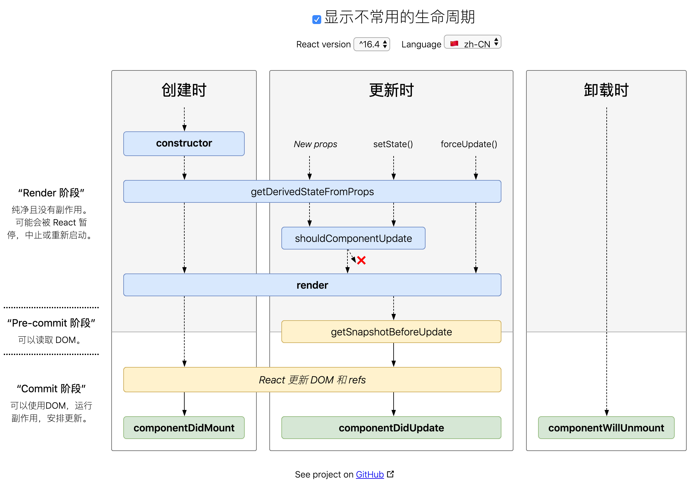

- [react 基础](#react-%E5%9F%BA%E7%A1%80)
  - [上下文](#%E4%B8%8A%E4%B8%8B%E6%96%87)
  - [高阶组件 higher-order components(HOC)](#%E9%AB%98%E9%98%B6%E7%BB%84%E4%BB%B6-higher-order-componentshoc)
  - [defaultProps 和类型检查 PropTypes](#defaultprops-%E5%92%8C%E7%B1%BB%E5%9E%8B%E6%A3%80%E6%9F%A5-proptypes)
  - [使用 React render prop components 替代 HOC 高阶组件](#%E4%BD%BF%E7%94%A8-react-render-prop-components-%E6%9B%BF%E4%BB%A3-hoc-%E9%AB%98%E9%98%B6%E7%BB%84%E4%BB%B6)
  - [state](#state)
  - [React State without a Constructor](#react-state-without-a-constructor)
  - [错误边界](#%E9%94%99%E8%AF%AF%E8%BE%B9%E7%95%8C)
  - [react 生命周期](#react-%E7%94%9F%E5%91%BD%E5%91%A8%E6%9C%9F)
    - [组件的生命周期可以分为三个时期](#%E7%BB%84%E4%BB%B6%E7%9A%84%E7%94%9F%E5%91%BD%E5%91%A8%E6%9C%9F%E5%8F%AF%E4%BB%A5%E5%88%86%E4%B8%BA%E4%B8%89%E4%B8%AA%E6%97%B6%E6%9C%9F)
    - [不安全的方法](#%E4%B8%8D%E5%AE%89%E5%85%A8%E7%9A%84%E6%96%B9%E6%B3%95)
  - [一切都可以做成组件](#%E4%B8%80%E5%88%87%E9%83%BD%E5%8F%AF%E4%BB%A5%E5%81%9A%E6%88%90%E7%BB%84%E4%BB%B6)
    - [alert 组件](#alert-%E7%BB%84%E4%BB%B6)
  - [遍历对象的属性](#%E9%81%8D%E5%8E%86%E5%AF%B9%E8%B1%A1%E7%9A%84%E5%B1%9E%E6%80%A7)
    - [this.props.children](#thispropschildren)
  - [ref 属性（获取真实的 DOM 节点）](#ref-%E5%B1%9E%E6%80%A7%E8%8E%B7%E5%8F%96%E7%9C%9F%E5%AE%9E%E7%9A%84-dom-%E8%8A%82%E7%82%B9)
- [react-router-dom](#react-router-dom)
  - [获取参数路由：](#%E8%8E%B7%E5%8F%96%E5%8F%82%E6%95%B0%E8%B7%AF%E7%94%B1)
  - [获取页面传参](#%E8%8E%B7%E5%8F%96%E9%A1%B5%E9%9D%A2%E4%BC%A0%E5%8F%82)
  - [页面跳转](#%E9%A1%B5%E9%9D%A2%E8%B7%B3%E8%BD%AC)
- [性能优化](#%E6%80%A7%E8%83%BD%E4%BC%98%E5%8C%96)
  - [componentWillUnmount](#componentwillunmount)
  - [使用 shouldComponentUpdate](#%E4%BD%BF%E7%94%A8-shouldcomponentupdate)
  - [PureComponent](#purecomponent)
  - [使用 React.Fragment 像 Vue 使用 template 那样输出](#%E4%BD%BF%E7%94%A8-reactfragment-%E5%83%8F-vue-%E4%BD%BF%E7%94%A8-template-%E9%82%A3%E6%A0%B7%E8%BE%93%E5%87%BA)
  - [想要返回多个元素而不添加顶级元素的三种方法：](#%E6%83%B3%E8%A6%81%E8%BF%94%E5%9B%9E%E5%A4%9A%E4%B8%AA%E5%85%83%E7%B4%A0%E8%80%8C%E4%B8%8D%E6%B7%BB%E5%8A%A0%E9%A1%B6%E7%BA%A7%E5%85%83%E7%B4%A0%E7%9A%84%E4%B8%89%E7%A7%8D%E6%96%B9%E6%B3%95)
    - [第一种： 使用数组](#%E7%AC%AC%E4%B8%80%E7%A7%8D-%E4%BD%BF%E7%94%A8%E6%95%B0%E7%BB%84)
    - [第二种： 使用 Fragment](#%E7%AC%AC%E4%BA%8C%E7%A7%8D-%E4%BD%BF%E7%94%A8-fragment)
    - [第三种： 使用高阶组件](#%E7%AC%AC%E4%B8%89%E7%A7%8D-%E4%BD%BF%E7%94%A8%E9%AB%98%E9%98%B6%E7%BB%84%E4%BB%B6)
- [技巧](#%E6%8A%80%E5%B7%A7)
  - [使用 react-powerplug 简化代码](#%E4%BD%BF%E7%94%A8-react-powerplug-%E7%AE%80%E5%8C%96%E4%BB%A3%E7%A0%81)
  - [显示或隐藏，少写一个 return](#%E6%98%BE%E7%A4%BA%E6%88%96%E9%9A%90%E8%97%8F%E5%B0%91%E5%86%99%E4%B8%80%E4%B8%AA-return)
- [React-Native 相关](#react-native-%E7%9B%B8%E5%85%B3)
  - [布局](#%E5%B8%83%E5%B1%80)
    - [宽和高](#%E5%AE%BD%E5%92%8C%E9%AB%98)
    - [与 css3 和而不同之处](#%E4%B8%8E-css3-%E5%92%8C%E8%80%8C%E4%B8%8D%E5%90%8C%E4%B9%8B%E5%A4%84)
- [其它资料](#%E5%85%B6%E5%AE%83%E8%B5%84%E6%96%99)

# react 基础

## 上下文

下面的例子是实现一个层层传递的例子：

```js
import React, { Component } from 'react';

const Topic = props => {
  return (
    <div>
      <Comment color={props.color} />
    </div>
  );
};

const Comment = props => {
  return <div>{props.color}</div>;
};
export default class Home extends Component {
  render() {
    return (
      <div>
        <Topic color="red" />
      </div>
    );
  }
}
```

我实际需要从 App -> Comment, 但是这确是一层一层的传下去的。

这个时候就可以使用上下文：

```js
---
+++
@@ -1,22 +1,35 @@
 import React, { Component } from 'react';
+import PropTypes from 'prop-types';

 const Topic = props => {
   return (
     <div>
-      <Comment color={props.color} />
+      <Comment />
     </div>
   );
 };

-const Comment = props => {
-  return <div>{props.color}</div>;
+const Comment = (props, context) => {
+  return <div>{context.color}</div>;
 };
 export default class Home extends Component {
+  getChildContext() {
+    // return 一个对象，里面的内容是我们想要传递的数据
+    return {
+      color: 'red',
+    };
+  }
   render() {
     return (
       <div>
-        <Topic color="red" />
+        <Topic />
       </div>
     );
   }
 }
\ No newline at end of file
+Home.childContextTypes = {
+  color: PropTypes.string,
+};
+Comment.contextTypes = {
+  color: PropTypes.string,
+};

```

简化一下也就是

```js
import React, { Component } from 'react';
import PropTypes from 'prop-types';

const Comment = (props, context) => {
  return <div>{context.word}</div>;
};

export default class Home extends Component {
  getChildContext() {
    return {
      word: 'hello world!',
    };
  }
  render() {
    return (
      <div>
        <Comment />
      </div>
    );
  }
}

Home.childContextTypes = {
  word: PropTypes.string,
};

Comment.contextTypes = {
  word: PropTypes.string,
};
```

## 高阶组件 higher-order components(HOC)

什么是高阶组件？

> 高阶组件（HOC）是 react 中的高级技术，用来重用组件逻辑。 但高阶组件本身并不是 React API。
> 它只是一种模式，这种模式是由 react 自身的组合性质必然产生的。
>
> 具体而言，**高阶组件**就是一个**函数**，且该函数**接受一个组件作为参数，并返回一个新的组件。**

```js
import React, { Component } from 'react';
const PropsLogger = WrapperComponent => {
  return class extends Component {
    render() {
      return <WrapperComponent {...this.props} />;
    }
  };
};

const Hello = PropsLogger(props => {
  return <p>Hello, {props.name}</p>;
});

export default class Home extends Component {
  render() {
    return (
      <div>
        <Hello name="rails365" />
      </div>
    );
  }
}
```

实例： loading

```js
import React, { Component } from 'react';
const PropsLogger = WrapperComponent => {
  return class extends Component {
    constructor(props) {
      super(props);

      this.state = {
        loading: true,
        jokes: null,
      };
    }

    componentDidMount() {
      setTimeout(() => {
        this.setState({ loading: false });
      }, 1000);
    }

    render() {
      if (this.state.loading) {
        return <div>loading...</div>;
      } else {
        return <WrapperComponent {...this.props} />;
      }
    }
  };
};

const Hello = PropsLogger(props => {
  return <p>Hello, {props.name}</p>;
});

export default class Home extends Component {
  render() {
    return (
      <div>
        <Hello name="rails365" />
      </div>
    );
  }
}
```

## defaultProps 和类型检查 PropTypes

> React.PropTypes 从 React v15.5 开始被移入了 prop-types，使用时需要留意;

使用的时候：

```js
import propTypes from 'prop-types';
```

在下面这个例子中，父组件调用子组件由于某些原因，没有传递 `name` 属性，Hello 组件输出`Hello,`

```js
import React, { Component } from 'react';

// 一个无状态组件
const Hello = props => {
  return <h1>Hello , {props.name}</h1>;
};

export default class Home extends Component {
  render() {
    return (
      <div>
        <Hello />
      </div>
    );
  }
}
```

添加默认值——方法一：

```js
import React, { Component } from 'react';

// 一个无状态组件
const Hello = props => {
  return <h1>Hello , {props.name}</h1>;
};

+ // 添加默认值
+ Hello.defaultProps = {
+   name: 'React',
+ };

+ 或者


export default class Home extends Component {
  render() {
    return (
      <div>
        <Hello name="react" />
      </div>
    );
  }
}

```

添加默认值——方法 2：

```js
---
+++
@@ -1,22 +1,29 @@
 import React, { Component } from 'react';
 import PropTypes from 'prop-types';

 // 一个无状态组件
-const Hello = props => {
-  return <h1>Hello , {props.name}</h1>;
-};
+// const Hello = props => {
+// 改成有状态组件
+class Hello extends Component {
+  static defaultProps = {
+    name: 'React',
+  };
+  render() {
+    return <h1>Hello , {this.props.name}</h1>;
+  }
+}

 // 添加默认值
-Hello.defaultProps = {
-  name: 'React',
-};
+// Hello.defaultProps = {
+//   name: 'React',
+// };

 export default class Home extends Component {
   render() {
     return (
       <div>
-        <Hello name="react" />
+        <Hello name="foobar" />
       </div>
     );
   }
 }

```

静态类型检查：

```js
import React, { Component } from 'react';
import propTypes from 'prop-types';

class Hello extends Component {
  static propTypes = {
    money: propTypes.number,
  };
  render() {
    return <div>Hello, {this.props.money.toFixed(2)}</div>;
  }
}

// 或者
// Hello.propTypes = {
//   name: propTypes.number
// }

export default class Home extends Component {
  render() {
    return (
      <div>
        <Hello money={'99'} />
      </div>
    );
  }
}
```

静态类型检查还可以加 `isRequired` 作为必传项：

```js
---
+++
@@ -1,13 +1,13 @@
 import React, { Component } from 'react';
 import propTypes from 'prop-types';

 class Hello extends Component {
   static propTypes = {
     money: propTypes.number,
-    name: propTypes.string,
+    name: propTypes.string.isRequired,
   };
   render() {
     return (
       <div>
         Hello, {this.props.name}, you got money: {this.props.money.toFixed(2)}
       </div>
@@ -16,11 +16,11 @@
 }

 export default class Home extends Component {
   render() {
     return (
       <div>
-        <Hello name={'100'} money={99} />
+        <Hello name="sennka" money={99} />
       </div>
     );
   }
 }

```

例子： 可以传入的是多种

```js
static propTypes = {
  children: propTypes.oneOfType([ // 下面两种类型其中之一
    PropTypes.node, // 单个的是组件节点
    PropTypes.arrayOf(PropTypes.node) // 或者是数组的
  ]).isRequired
}

```

## 使用 React render prop components 替代 HOC 高阶组件

能够用高阶组件实现的东西，也能用 Render Props 实现，而且`Render Props`比高阶组件还有更多的好处。

```js
import React from 'react';
import propTypes from 'prop-types';
// 对传入的 Component 进行 withMouse 功能增强
class Mouse extends React.Component {
  state = { x: 0, y: 0 };

  static propTypes = {
    render: propTypes.func.isRequired,
  };

  handleMouseMove = event => {
    this.setState({
      x: event.clientX,
      y: event.clientY,
    });
  };
  render() {
    return (
      <div
        style={{ position: 'fixed', top: 40, left: 0, right: 0, bottom: 0 }}
        onMouseMove={this.handleMouseMove}
      >
        {/* <Component {...this.props} mouse={this.state} /> */}
        {/* 这里就没有传进来的组件了,这里取参数的方法很明确，就是this.state */}
        {this.props.render(this.state, this.props, 'foobar')}
      </div>
    );
  }
}

const Position = ({ x, y }) => (
  <h1>
    The mouse position is {x}, {y}
  </h1>
);

const App = props => {
  return (
    <React.Fragment>
      <Mouse render={props => <Position {...props} />} />
    </React.Fragment>
  );
};

export default App;
```

## state

state 是组件私有的，可以通过 `state = {}` 方式初始化，通过调用 `this.setState()` 来改变它。
当 `state` 更新之后，组件就会重新渲染自己。

`render` 方法依赖于 `this.props` 和 `this.state`，框架会确保渲染出来的 UI 界面总是与输入的
`this.props`和`this.state`保持一致。

## React State without a Constructor

比较下面代码有什么区别：

```js
export default class Home extends Component {
  state = {
    x: 0,
    y: 0,
  };
  render() {
    return <div />;
  }
}
```

和

```js
export default class Home extends Component {
  constructor(props) {
    super(props);
    this.state = {
      x: 0,
      y: 0,
    };
  }
  render() {
    return <div />;
  }
}
```

以上两种方法在组件的生命周期中**都**仅执行一次，用于设置组件的初始化 state。

## 错误边界

有时候，由于一个组件的错误(或说崩溃)，会导致整个页面一个空白。但是我们希望如果组件出错了，就不显示
这个组件，其它的还是应该显示。

```js
// app.js
import React, { Component } from 'react';
import Broken from './Broken';
import ErrorBoundary from './ErrorBoundary';

class App extends Component {
  state = {
    counter: 0,
  };

  increment = () => {
    this.setState(prevState => ({ counter: prevState.counter + 1 }));
  };

  decrement = () => {
    this.setState(prevState => ({ counter: prevState.counter - 1 }));
  };

  render() {
    return (
      <div className="App">
        <h1>Hello React</h1>
        <hr />
        <div>Counter: {this.state.counter}</div>
        <button className="btn btn-success" onClick={this.increment}>
          Increment
        </button>
        <button className="btn btn-danger" onClick={this.decrement}>
          Decrement
        </button>
        <hr />
        <ErrorBoundary>
          <Broken />
        </ErrorBoundary>
      </div>
    );
  }
}

export default App;
```

```js
// Broken.js
import React, { Component } from 'react';

export default class Broken extends Component {
  render() {
    return (
      <div>
        {null.map(item => (
          <div>{item}</div>
        ))}
      </div>
    );
  }
}
```

```js
// ErrorBoundary.js
import React, { Component } from 'react';

export default class ErrorBoundary extends Component {
  state = {
    hasError: false,
    error: null,
    errorInfo: null,
  };
  /**
   * 类似于 try / catch
   * 它会捕获一些错误，接收的两个参数是生命周期函数所规定好的
   * 如果有错误就把 error, errorInfo 放进 state 中去
   * 也就是说当这个子组件发生错误之后，就会触发 componentDidCatch 事件
   *
   * @param {*} error
   * @param {*} errorInfo
   */
  componentDidCatch(error, errorInfo) {
    this.setState({
      hasError: true,
      error,
      errorInfo,
    });
  }
  render() {
    return this.state.hasError ? (
      <React.Fragment>
        <div>Oops, error occurred.</div>
        <div>{this.state.error && this.state.error.toString()}</div>
        <div>{this.state.errorInfo && this.state.errorInfo.componentStack}</div>
      </React.Fragment>
    ) : (
      // 等于说这是一个父组件，它接收子组件
      this.props.children
    );
  }
}
```

## react 生命周期

在 iOS 中 UIViewController 提供了

- `(void)viewWillAppear: ( B0OL )animated`，
- `-(void )viewDidLoad` ,
- `(void)viewWillDisappear: (B0OL ) animated`

等生命周期方法，

在 `Android`中 `Activity` 則提供了

- onCreate()
- onStart()
- onResume()
- onPause()
- onStop()
- onDestroy()

等生命周期方法，遠些生命周期方法描述了一个界面从創建到銷毀的一生。

- [http://projects.wojtekmaj.pl/react-lifecycle-methods-diagram/](http://projects.wojtekmaj.pl/react-lifecycle-methods-diagram/)
- [https://reactjs.org/docs/react-component.html 官方文档-组件及生命周期](https://reactjs.org/docs/react-component.html)




### 组件的生命周期可以分为三个时期

- Mounting： 创建时
- Updating： 更新时
- Unmounting： 卸载时

### 不安全的方法

- componentWillMount
- componentWillReceiveProps
- componentWillUpdate

使用这些生命周期方法通常会导致错误和不一致，因此将来会被弃用。在新的 React 版本中他们被标记为 UNSAFE。

如果你使用了这些不安全的方法，请查阅[官方文档如何替换不安全的生命周期方法](https://reactjs.org/docs/react-component.html)

## 一切都可以做成组件

### alert 组件

```js
import React, { Component } from 'react';

class AlertComponent extends Component {
  showAlert(message) {
    alert(`Debug: ${message}`);
  }
  render() {
    return null;
  }
}

export default class Home extends Component {
  handleClick = () => {
    this.refs.alert.showAlert('MyTitle');
  };
  render() {
    return (
      <div>
        <button className="btn btn-success" onClick={this.handleClick}>
          click me
        </button>
        <AlertComponent ref="alert" />
      </div>
    );
  }
}
```

## 遍历对象的属性

### this.props.children

`this.props.children` 会返回组件对象的所有属性。React 提供一个工具方法 `React.Children` 来
处理 `this.props.children`。我们可以用 `React.Children.map` 或 `React.Children.forEach` 来遍
历子节点。

```js
React.Children.map(children, function[(thisArg)])
```

在包含在 `children` 里的每个子级上调用函数，调用的函数的 `this` 设置为 `thisArg` 。如果 `children` 是
一个嵌套的对象或数组，它将被遍历。如果 `children` 是 `null` 或 `undefined`，返回 `null` 或 `undefined`
而不是一个空数组。

```js
import React, { Component } from 'react';

class Wrapper extends Component {
  componentDidMount() {
    console.log(React.Children);
  }
  render() {
    return (
      <ol>
        {React.Children.map(this.props.children, child => {
          return <li>{child}</li>;
        })}
      </ol>
    );
  }
}

export default class Home extends Component {
  render() {
    return (
      <div>
        <Wrapper>
          <span>a</span>
          <span>b</span>
          <span>c</span>
        </Wrapper>
      </div>
    );
  }
}
```

## ref 属性（获取真实的 DOM 节点）

组件并不是真实的 DOM 节点，而是存在于内存之中的一-种数据结构，叫做虚拟 DOM
(virtual DOM)。只有当它插入文档以后，才会变成真实的 DOM。根据 React 的设计，所有的 DOM 变
动，都先在虚拟 DOM 上发生，然后再将实际发生变动的部分，反映在真实 DOM 上，这种算法叫做
`DOM diff`，它可以极大提高网页的性能表现。

但是，有时需要从组件获取真实 DOM 的节点，这时就要用到 ref 属性。

```js
import React, { Component } from 'react';

class AlertComponent extends Component {
  showAlert(message) {
    alert(`Debug: ${message}`);
  }
  render() {
    return null;
  }
}

export default class Home extends Component {
  handleClick = () => {
    this.refs.alert.showAlert('MyTitle');
  };
  render() {
    return (
      <div>
        <button className="btn btn-success" onClick={this.handleClick}>
          click me
        </button>
        <AlertComponent ref="alert" />
      </div>
    );
  }
}
```

上面代码中，组件 MyTitle 的子节点有一个 Alert 组件， 为了调用这个组件提供的方法，这时就必须
获取真实的 DOM 节点，虚拟 DOM 是拿不到用户输入的。为了做到这一-点，我们在使用这个组件
的时候必须为其设置一个 ref 属性，然后 `this.refs.[refName]`就会返回这个真实的 DOM 节点。
需要注意的是，由于 `this.refs.[refName]`属性获取的是真实 DOM，所以必须等到虚拟 DOM 插入文
档以后，才能使用这个属性，否则会报错。上面代码中，通过为组件指定 **Click 事件的回调函数**，
确保了只有**等到真实 DOM 发生 Click 事件之后**，才会读取 `this.refs.[refName]`属性。
React 组件支持很多事件，除了 Click 事件以外，还有 KeyDown、Copy、 Scroll 等，完整的事件
清单请查看官方文档。

> 心得: ref 属性在开发中使用频率很高，使用它你可以获取到任何你想要获取的组件的对象，有了
> 这个对象你就可以灵活地做很多事情，比如:读写对象的变量，甚至调用对象的函数。

# react-router-dom

## 获取参数路由：

```jsx
<Route path="/news/:id" component={News} />
<Link to="/news/100">
```

```js
import React, { Component } from 'react';

export default class Home extends Component {
  render() {
    return <div>Hello World!</div>;
  }
}
```

## 获取页面传参

```js
import React, { Component } from 'react';
import qs from 'querystring';
export default class Contact extends Component {
  constructor(props) {
    super(props);
    console.table(this.props);
    console.log(qs.parse(this.props.location.search.substr(1)));
    var obj = { foobar: '我是谁' };
    console.log(qs.stringify(obj));
    console.log(JSON.stringify(obj));
  }
  render() {
    return <div>Hello Contact!</div>;
  }
}
```

## 页面跳转

函数式页面跳转

```js
import React, { Component } from 'react';
import qs from 'querystring';
export default class Contact extends Component {
  constructor(props) {
    super(props);
    console.table(this.props);
    console.log(qs.parse(this.props.location.search.substr(1)));
    var obj = { foobar: '我是谁' };
    console.log(qs.stringify(obj));
    console.log(JSON.stringify(obj));
  }
+  redirectTo() {
+    this.props.history.push('/home');
+  }
  render() {
-     return <div>Hello Contact!</div>;
+    return (
+      <div>
+        <div>Hello Contact!</div>
+        <button
+          className="btn btn-link"
+          onClick={() => this.redirectTo('/home')}
+        >
+          Go Home
+        </button>
+      </div>
    );
  }
}

```

# 性能优化

## componentWillUnmount

在组件从 DOM 中移除的时候立刻被调用。

在该方法中执行任何必要的清理，比如无效的定时器，或者清除在 componentDidMount 中创建的 DOM 元素，
或者取消耗时长的请求。

```js
componentWillUnmount() {
  axios({
    url: 'http://jsonplaceholder.typicode.com/comments',
    method: 'GET',
    cancelToken: new axios.CancelToken(c => {
      // 这个参数 c 就是 CancelToken 构造函数里面自带的取消请求的函数，这里把该函数当参数用
      this.cancle = c;
    }),
  }).then(res => {
    console.log(res);
  }).catch(err => {
    console.log(err);
  });
  setTimeout(() => {
    this.cancle('主动取消');
  }, 100);
}
```

## 使用 shouldComponentUpdate

如果你要重写这个方法，你需要返回一个 true 或 false。

使用 `shouldComponentUpdate` 的时候， 可以返回一个 boolean ，

如果是 false， 则不会重新渲染页面，如果是 true 则重新渲染页面。

当配合无状态组件的时候， 我们希望如果每次(setInterval)传入的值跟之前的值没有变化，则不渲染
页面，以便优化新能。

```js
const Temp = props => {
  console.log('render Temp');
  return <div>{props.val}</div>;
};
```

```js
export default class Home extends Component {
  constructor(props) {
    super(props);
    this.state = {
      val: 1,
    };
  }
  componentDidMount() {
    setInterval(() => {
      this.setState({
        val: this.state.val, // 即是 val 的值保持不变，但是 render, render Temp 一直在渲染变化
      });
    }, 1000);
  }
  shouldComponentUpdate(nextProps, nextState) {
    console.log(`nextState is: `, nextState);
    return this.state.val === nextState.val ? false : true;
  }
  render() {
    console.log('render');
    return (
      <div>
        <div>Hello World!</div>
        <Temp val={this.state.val} />
      </div>
    );
  }
}
```

会只循环地输出 `nextState is: {val: 1}`

## PureComponent

```js
import React, { Component, PureComponent } from 'react';
class Temp extends PureComponent {
  render() {
    console.log('render Temp');
    return <div>{this.props.val}</div>;
  }
}
export default class Home extends Component {
  constructor(props) {
    super(props);
    this.state = {
      val: 1,
    };
  }
  componentDidMount() {
    setInterval(() => {
      this.setState({
        val: this.state.val, // 即是 val 的值保持不变，但是 render, render Temp 一直在渲染变化
      });
    }, 1000);
  }
  // shouldComponentUpdate(nextProps, nextState) {
  //   console.log(`nextState is: `, nextState);
  //   return this.state.val === nextState.val ? false : true;
  // }
  render() {
    console.log('render app');
    return (
      <div>
        <div>Hello World!</div>
        <Temp val={this.state.val} />
      </div>
    );
  }
}
```

这个 `render app` 会一直输出着，但是 `render Temp` 却不会重新渲染。

## 使用 React.Fragment 像 Vue 使用 template 那样输出

```js
import React, { Component } from 'react';

export default class Home extends Component {
  constructor(props) {
    super(props);
    this.state = {
      list: ['复读机1', '复读机2'],
    };
  }

  render() {
    return (
      <div>
        <ul>
          {this.state.list.map((item, index) => {
            return (
              <React.Fragment key={index}>
                <li>{item}</li>
                <li>{item}</li>
                <li>{item}</li>
              </React.Fragment>
            );
          })}
        </ul>
      </div>
    );
  }
}
```

这个链接可以：[https://pawelgrzybek.com/return-multiple-elements-from-a-component-with-react-16/](https://pawelgrzybek.com/return-multiple-elements-from-a-component-with-react-16/)可以看更多的这种用法

## 想要返回多个元素而不添加顶级元素的三种方法：

我们想要组件返回一个 `<h1>`和`<p>` ，一般来说需要把用一个顶级的 `<div>` 把它们包裹起来：

```js
const SomeComponent = ({ name }) => {
  return (
    <div>
      <h1>Hello React</h1>
      <p>Hello, {name}</p>
    </div>
  );
};
```

不过这样就多出来了一个不期望的 `<div>`元素，下面将介绍三种不用多出这个 `<div>` 元素的方法：

### 第一种： 使用数组

```js
const SomeComponent = ({ name }) => {
  return [<h1 key="h1">Hello React</h1>, <p key="p">Hello, {name}</p>];
};
```

### 第二种： 使用 Fragment

```js
const SomeComponent = ({ name }) => {
  return (
    <React.Fragment>
      <h1>Hello React</h1>
      <p>Hello, {name}</p>
    </React.Fragment>
  );
};
```

### 第三种： 使用高阶组件

```js
// const Wrapper = ({ children }) => {
//   console.log(children);
//   return children;
// };
// output:  [{…}, {…}]
const Wrapper = ({ children }) => children;

const SomeComponent = ({ name }) => {
  return (
    <Wrapper>
      <h1>Hello React</h1>
      <p>Hello, {name}</p>
    </Wrapper>
  );
};
```

**注意**:

```js
const Wrapper = ({ children }) => children;
// 这个相关于
const Wrapper = props => props.children;
```

这样更容易理解些吧？

以上。第二种、第三种都不用传入 key， 简单一些。

不过第三种也有人说：

> 我觉得这里不应该称之为高阶组件，Wrapper 是一个函数，但是并没有把组件作为参数，也并没有把组件作为返回值。 Wrapper 就是一个无状态组件，算不上高阶组件
>
> [@Muyu](https://www.rails365.net/users/2920)

# 技巧

## 使用 react-powerplug 简化代码

这是一个 counter 的例子

```js
import React, { Component } from 'react';

export default class Home extends Component {
  constructor(props) {
    super(props);

    this.state = {
      counter: 0,
    };
  }
  increment = () => {
    this.setState({
      counter: this.state.counter + 1,
    });
  };
  decrement = () => {
    this.setState({
      counter: this.state.counter - 1,
    });
  };

  render() {
    return (
      <div>
        <h1>Counter: {this.state.counter}</h1>
        <button className="btn btn-danger" onClick={this.decrement}>
          Decrement
        </button>
        <button className="btn btn-success" onClick={this.increment}>
          Increment
        </button>
      </div>
    );
  }
}
```

使用了 `react-powerplug` 以后可以简化成下面的样子：

```js
---
+++
@@ -1,33 +1,31 @@
 import React, { Component } from 'react';
+import { State } from 'react-powerplug';

 export default class Home extends Component {
-  constructor(props) {
-    super(props);
-
-    this.state = {
-      counter: 0,
-    };
+  shouldComponentUpdate(state, nextState) {
+    console.log('不会触发 shouldComponentUpdate');
   }
-  increment = () => {
-    this.setState({
-      counter: this.state.counter + 1,
-    });
-  };
-  decrement = () => {
-    this.setState({
-      counter: this.state.counter - 1,
-    });
-  };
-
   render() {
     return (
       <div>
-        <h1>Counter: {this.state.counter}</h1>
-        <button className="btn btn-danger" onClick={this.decrement}>
-          Decrement
-        </button>
-        <button className="btn btn-success" onClick={this.increment}>
-          Increment
-        </button>
+        <State initial={{ counter: 0 }}>
+          {({ state, setState }) => (
+            <div>
+              <h1>Counter: {state.counter}</h1>
+              <button
+                className="btn btn-danger"
+                onClick={() => setState({ counter: state.counter - 1 })}
+              >
+                Decrement
+              </button>
+              <button
+                className="btn btn-success"
+                onClick={() => setState({ counter: state.counter + 1 })}
+              >
+                Increment
+              </button>
+            </div>
+          )}
+        </State>
-      </div>
-    );
\ No newline at end of file
+      </div>
+    );

```

简单的例子：

```js
import React, { Component } from 'react';
import { State } from 'react-powerplug';

export default class Home extends Component {
  shouldComponentUpdate(state, nextState) {
    console.log('不会触发 shouldComponentUpdate');
  }
  render() {
    return (
      <div>
        <State initial={{ counter: 0 }}>
          {({ state, setState }) => (
            <div>
              <h1>Counter: {state.counter}</h1>
              <button
                className="btn btn-danger"
                onClick={() => setState({ counter: state.counter - 1 })}
              >
                Decrement
              </button>
              <button
                className="btn btn-success"
                onClick={() => setState({ counter: state.counter + 1 })}
              >
                Increment
              </button>
            </div>
          )}
        </State>
      </div>
    );
  }
}
```

## 显示或隐藏，少写一个 return

如果 toggle 为真，显示 List 组件

```js
{
  this.state.toggle && <List list={list} />;
}
```

例子

```js
import React, { Component } from 'react';

const list = ['a', 'b', 'c'];

class App extends Component {
  constructor(props) {
    super(props);

    this.state = {
      toggle: true,
    };
  }

  onToggleList = () => {
    this.setState(prevState => ({
      toggle: !prevState.toggle,
    }));
  };

  render() {
    return (
      <div>
        <Toggle toggle={this.state.toggle} onToggleList={this.onToggleList} />
        {this.state.toggle && <List list={list} />}
      </div>
    );
  }
}

const Toggle = ({ toggle, onToggleList }) => (
  <button type="button" onClick={onToggleList}>
    {toggle ? 'Hide' : 'Show'}
  </button>
);

const List = ({ list }) => (
  <ul>
    {list.map(item => (
      <Item key={item} item={item} />
    ))}
  </ul>
);

const Item = ({ item }) => <li>{item}</li>;

export default App;
```

# React-Native 相关

## 布局

### 宽和高

- 在 React-Native 中，使用的是弹性盒子布局
- 在 React-Native 中，尺寸是没有单位的，它代表了设备独立像素。

### 与 css3 和而不同之处

值得一提的是，React Native 中的 FlexBox 和 Web CSSS 上 FlexBox 工作方式是一样的。但有些地方还是有些出入的，如：

- flexDirection: React Native 中默认为`flexDirection:'column'`，在 Web CSS 中默认为`flex-direction:'row'`
- alignItems: React Native 中默认为`alignItems:'stretch'`，在 Web CSS 中默认`align-items:'flex-start'`
- flex: 相比 Web CSS 的 flex 接受多参数，如:`flex: 2 2 10%;`，但在 React Native 中 flex 只接受一个参数
- 不支持属性：align-content，flex-basis，order，flex-basis，flex-flow，flex-grow，flex-shrink

以上是 React Native 中的 FlexBox 和 Web CSSS 上 FlexBox 的不同之处，记住这几点，你可以像在 Web CSSS 上使用 FlexBox 一样，在 React Native 中使用 FlexBox。

# 其它资料

- [ReactJS 中文文档](https://react.docschina.org/docs/higher-order-components.html)
- [ReactJS 官方文档](https://reactjs.org/)
